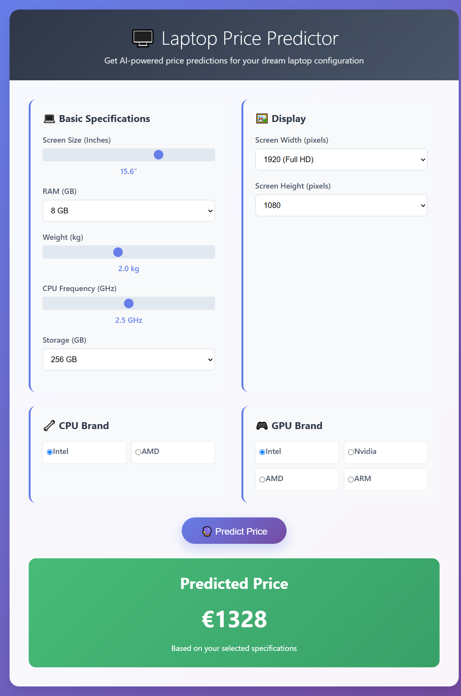

# Laptop Price Predictor - Setup Instructions

## Step-by-Step Implementation Guide

### Stage 1: Prepare Your Trained Model

1. **Run your existing training script** with the additional export code:
   ```bash
   python model.py
   ```
   
2. **Add the export code** to the end of your training script (see `export_model.py`):
   - This will save your trained model as `laptop_price_model.h5`
   - This will save your scaler as `scaler.pkl`
   - This will save feature names as `feature_names.pkl`

3. **Verify files are created**:
   - `laptop_price_model.h5` (your trained neural network)
   - `scaler.pkl` (StandardScaler used during training)


### Stage 2: Set Up Project Directory

Create a new directory for your web application:

```
laptop_predictor/
├── app.py                    # Flask backend (from flask_app.py)
├── laptop_predictor.html     # Frontend interface
├── laptop_price_model.h5     # Your trained model
├── scaler.pkl               # Your fitted scaler
├── requirements.txt         # Python dependencies
└── README.md               # This file
```

### Stage 3: Install Dependencies

1. **Create a virtual environment** (recommended):
   ```bash
   python -m venv laptop_env
   
   # On Windows:
   laptop_env\Scripts\activate
   
   # On macOS/Linux:
   source laptop_env/bin/activate
   ```

2. **Install required packages**:
   ```bash
   pip install -r requirements.txt
   ```

### Stage 4: File Setup

1. **Save the HTML file**:
   - Copy the HTML content from the artifact to `laptop_predictor.html`

2. **Save the Flask app**:
   - Copy the Python code from `flask_app.py` to `app.py`

3. **Move your model files**:
   - Copy `laptop_price_model.h5` to the project directory
   - Copy `scaler.pkl` to the project directory

### Stage 5: Run the Application

1. **Start the Flask server**:
   ```bash
   python app.py
   ```

2. **Open your browser** and go to:
   ```
   http://localhost:5000
   ```

3. **Test the application**:
   - Adjust the sliders and dropdowns
   - Click "Predict Price"
   - See the predicted price

### Stage 6: Feature Mapping Verification

**CRITICAL**: Ensure your model's input features match the frontend exactly:

Your model expects these 13 features in this order:
1. `Inches` → Screen size slider
2. `Ram` → RAM dropdown
3. `Weight` → Weight slider
4. `CPU Frequency` → CPU frequency slider
5. `Memory Amount` → Storage dropdown
6. `Screen Width` → Screen width dropdown
7. `Screen Height` → Screen height dropdown
8. `Intel_CPU` → CPU brand selection (1 if Intel, 0 otherwise)
9. `Nvidia_GPU` → GPU brand selection (1 if Nvidia, 0 otherwise)
10. `AMD_CPU` → CPU brand selection (1 if AMD, 0 otherwise)
11. `AMD_GPU` → GPU brand selection (1 if AMD, 0 otherwise)
12. `Intel_GPU` → GPU brand selection (1 if Intel, 0 otherwise)
13. `ARM_GPU` → GPU brand selection (1 if ARM, 0 otherwise)

### Stage 7: Testing and Debugging

1. **Test with known values**:
   - Input specifications of a laptop you know the price of
   - Check if the prediction is reasonable

2. **Check the console**:
   - Flask will show logs in the terminal
   - Browser console (F12) will show any JavaScript errors

3. **Health check endpoint**:
   - Visit `http://localhost:5000/health` to verify model loading

### Stage 8: Deployment (Optional)

For production deployment:

1. **Use a production WSGI server**:
   ```bash
   pip install gunicorn
   gunicorn -w 4 -b 0.0.0.0:5000 app:app
   ```

2. **Deploy to cloud platforms**:
   - Heroku
   - AWS EC2
   - Google Cloud Platform
   - Azure

### Troubleshooting

**Common Issues:**

1. **Model not loading**:
   - Check if `laptop_price_model.h5` exists
   - Verify TensorFlow version compatibility

2. **Scaler not loading**:
   - Check if `scaler.pkl` exists
   - Ensure pickle compatibility

3. **Prediction errors**:
   - Verify feature order matches training
   - Check input data types (int vs float)

4. **CORS errors**:
   - Ensure Flask-CORS is installed
   - Check if frontend and backend URLs match

5. **HTML not loading**:
   - Make sure `laptop_predictor.html` is in the same directory as `app.py`

### Next Steps

1. **Improve the UI**:
   - Add more laptop brands
   - Include laptop type selection (Gaming, Ultrabook, etc.)
   - Add more detailed specifications

2. **Enhance predictions**:
   - Add confidence intervals
   - Show feature importance
   - Compare with similar laptops

3. **Add features**:
   - Save/load configurations
   - Export predictions
   - Historical price trends

4. **Optimize performance**:
   - Cache model predictions
   - Implement model quantization
   - Add batch prediction support
